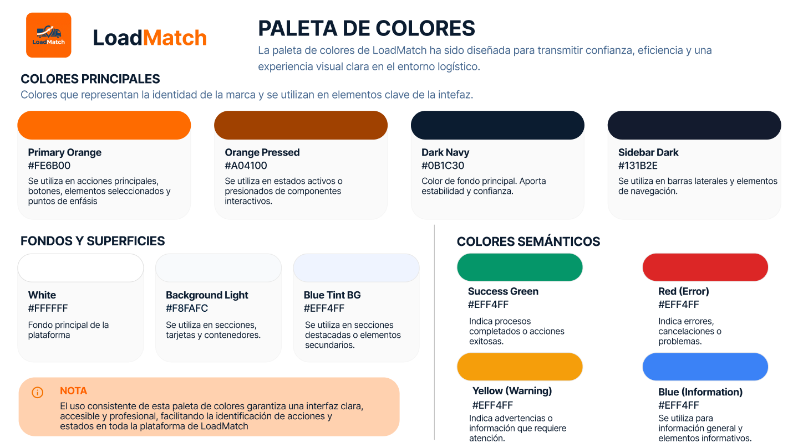
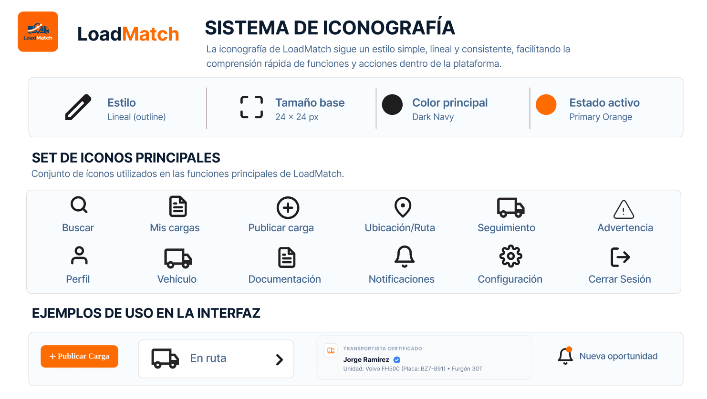

# Capítulo IV: Product Design

## 4.1. Style Guidelines

LoadMatch es una plataforma digital orientada a facilitar la conexión entre empresas que requieren servicios de transporte de carga y transportistas con capacidad disponible. Debido a que la solución involucra procesos de coordinación, contratación, seguimiento y validación de servicios, la interfaz debe transmitir confianza, claridad y eficiencia durante toda la experiencia de uso.

Las Style Guidelines de LoadMatch establecen los principales lineamientos visuales y de comunicación que deberán mantenerse de forma consistente en la Landing Page y en la Web Application. Estos lineamientos comprenden aspectos como tipografía, colores, iconografía, espaciado, componentes de interfaz y tono de comunicación.

El objetivo de esta guía es mantener una identidad visual coherente en todos los puntos de interacción con el usuario y facilitar que el equipo de diseño y desarrollo trabaje bajo un mismo criterio. De esta manera, se busca que la plataforma resulte fácil de comprender, visualmente consistente y adecuada para usuarios que necesitan consultar información, crear solicitudes de transporte o gestionar servicios de manera rápida y ordenada.

### 4.1.1. General Style Guidelines

La identidad visual de LoadMatch está orientada a transmitir confianza, profesionalismo y eficiencia, características importantes dentro de una plataforma que facilita la coordinación de servicios de transporte de carga entre diferentes participantes.

El diseño busca mantener una apariencia moderna, limpia y funcional, evitando elementos visuales innecesarios que puedan dificultar la comprensión de la información. Se priorizará una jerarquía visual clara, una distribución ordenada de los elementos y una adecuada legibilidad, especialmente en secciones donde el usuario necesite consultar información relacionada con solicitudes, transportistas, vehículos o estados de servicio.

Asimismo, la interfaz deberá mantener consistencia entre sus diferentes secciones, utilizando patrones visuales y componentes reconocibles que permitan al usuario identificar fácilmente acciones, estados e información relevante. Esto permitirá reducir la carga cognitiva durante la navegación y facilitar el aprendizaje progresivo del funcionamiento de la plataforma.

En cuanto al tono de comunicación, LoadMatch se posiciona como una plataforma:

- **Profesional**, debido a que facilita operaciones relacionadas con transporte y actividades empresariales.
- **Confiable**, especialmente al presentar información sobre transportistas, vehículos, documentación y servicios.
- **Clara**, utilizando textos y mensajes fáciles de comprender y evitando términos innecesariamente complejos.
- **Directa**, priorizando instrucciones y acciones concretas durante la interacción con la plataforma.
- **Cercana**, manteniendo una comunicación accesible tanto para empresas como para transportistas independientes.

Estos principios servirán como base para definir posteriormente la tipografía, paleta de colores, iconografía, espaciado y componentes visuales utilizados en LoadMatch.

#### 4.1.1.1. Typography

La tipografía de LoadMatch ha sido definida con el objetivo de mantener una interfaz clara, profesional y legible en contextos donde los usuarios necesitan consultar información operativa de manera rápida, como solicitudes de carga, estados de servicio, rutas, documentación y seguimiento.

La familia tipográfica principal de la plataforma es **Inter**, utilizada en la mayor parte de la interfaz por su alta legibilidad en entornos digitales y su versatilidad para establecer diferentes niveles de jerarquía visual. Se emplean distintos pesos tipográficos, entre ellos Regular, Medium, SemiBold, Bold y ExtraBold, de acuerdo con la relevancia de cada elemento dentro de la interfaz.

Como tipografía complementaria se utiliza **Liberation Serif** en determinados títulos y elementos destacados de identidad visual. Su uso se mantiene limitado a encabezados específicos con el propósito de generar contraste visual sin afectar la consistencia general de la plataforma.

La jerarquía tipográfica de LoadMatch se organiza de la siguiente manera:

- **Page Title / H1:** Inter ExtraBold, 30 px.
- **Section Heading / H2:** Inter Bold, entre 20 px y 24 px.
- **Subheading:** Inter SemiBold, 16 px.
- **Body Text:** Inter Regular, 14 px.
- **Small / Caption:** Inter Regular, 12 px.
- **Micro / Labels:** Inter Regular, 11 px.

El interlineado se adapta aproximadamente entre 1.3 y 1.5 veces el tamaño de la fuente, favoreciendo la lectura tanto en bloques de contenido como en interfaces con alta densidad de información. Para etiquetas y elementos pequeños se aplica un ligero espaciado entre caracteres con el fin de mejorar su diferenciación visual.

   
  <i>Nota. Sistema tipográfico utilizado en la identidad visual de LoadMatch</i>

#### 4.1.1.2. Colors

La paleta de colores de LoadMatch ha sido definida con el propósito de transmitir una identidad visual moderna, confiable y vinculada al entorno logístico. El sistema combina colores de marca con tonos neutros y colores semánticos que permiten diferenciar acciones, estados e información dentro de la plataforma.

El **naranja (#FE6B00)** constituye el color principal de LoadMatch y se utiliza especialmente en acciones importantes, botones principales, elementos seleccionados, indicadores y puntos de énfasis dentro de la interfaz. Su uso permite dirigir rápidamente la atención del usuario hacia las acciones prioritarias.

Como variación para estados de interacción se utiliza el tono **Orange Pressed (#D04100)**, principalmente en estados activos o presionados de componentes interactivos.

Los tonos **Dark Navy (#0B1C30)** y **Sidebar Dark (#131B2E)** son empleados en elementos estructurales y de navegación, especialmente en fondos oscuros, barras laterales, encabezados y determinadas áreas de alto contraste. Estos colores permiten equilibrar visualmente el naranja principal y contribuyen a transmitir una imagen profesional y confiable.

Para los fondos y superficies se utilizan principalmente **White (#FFFFFF)**, **Background Light (#F8FAFC)** y **Blue Tint Background (#EFF4FF)**. Estos tonos claros permiten mantener una interfaz limpia y facilitan la separación visual entre secciones, tarjetas, formularios y otros componentes.

LoadMatch también utiliza colores semánticos para comunicar el estado de determinadas operaciones. El **Success Green (#059669)** identifica estados positivos, como elementos verificados o procesos completados, mientras que el **Error Red (#DC2626)** se emplea para errores, cancelaciones o acciones destructivas. Los estados de advertencia e información utilizan tonos diferenciados que permiten al usuario reconocer rápidamente el significado de cada indicador.

Finalmente, se utiliza una escala de tonos **Slate** para textos, bordes, iconos, separadores y elementos secundarios de la interfaz. Esta escala permite establecer distintos niveles de jerarquía visual sin recurrir constantemente a los colores principales de la marca.

El uso consistente de esta paleta facilita la identificación de acciones y estados, mantiene una adecuada jerarquía visual y refuerza la identidad gráfica de LoadMatch.

   
  <i>Nota. Sistema tipográfico utilizado en la identidad visual de LoadMatch.</i>

#### 4.1.1.3. Spacing

El sistema de espaciado de LoadMatch se basa en una cuadrícula de **4 píxeles**, permitiendo mantener consistencia visual entre los diferentes componentes de la interfaz. A partir de esta unidad base se utilizan principalmente valores de **4, 8, 12, 16, 24 y 32 píxeles**, dependiendo del nivel de separación requerido.

Los espacios de **4 px** se emplean principalmente entre elementos muy próximos, como iconos y textos; **8 px** para agrupaciones compactas y componentes pequeños; **12 px** para separaciones internas frecuentes; **16 px** para el contenido de tarjetas y formularios; **24 px** para secciones con mayor separación visual; y **32 px** para dividir bloques principales dentro de una página.

Este sistema permite organizar la información de manera clara y predecible, evitando la saturación visual y facilitando la lectura de elementos operativos como solicitudes de carga, formularios, estados y rutas. Asimismo, contribuye a mantener una experiencia consistente en las distintas vistas de la plataforma.

#### 4.1.1.4. Iconography

La iconografía de LoadMatch sigue un estilo **simple, reconocible y consistente**, orientado a facilitar la comprensión rápida de las principales acciones y funcionalidades de la plataforma. Los iconos se utilizan como apoyo visual en elementos de navegación, formularios, estados, botones y diferentes componentes relacionados con la gestión del transporte de carga.

Se priorizan iconos de apariencia limpia y principalmente lineal, manteniendo proporciones y tamaños consistentes dentro de cada contexto de uso. En elementos activos o acciones prioritarias, los iconos pueden adoptar el color principal de LoadMatch, **Primary Orange (#FE6B00)**, mientras que los elementos secundarios utilizan principalmente tonos de la escala Slate.

Entre los principales usos de la iconografía se encuentran acciones como **buscar cargas, publicar una carga, consultar rutas, acceder al historial, gestionar el perfil, configurar la cuenta, visualizar notificaciones y consultar información relacionada con vehículos o documentación**.

El uso de iconos junto con etiquetas textuales permite disminuir la carga cognitiva y facilita la navegación tanto para empresas que requieren servicios de transporte como para transportistas que buscan nuevas oportunidades de carga.

   
  <i>Nota. Sistema de iconografía utilizado en la interfaz de LoadMatch.</i>

#### 4.1.1.5. Tone of Communication and Applied Language

El tono de comunicación de LoadMatch es **claro, directo, profesional y orientado a la acción**. Debido a que la plataforma se utiliza para gestionar operaciones relacionadas con transporte y logística, la información debe presentarse de manera sencilla y comprensible, evitando términos innecesariamente complejos o mensajes ambiguos.

Los textos de la interfaz priorizan instrucciones breves y acciones fácilmente identificables, especialmente en procesos como la publicación de una carga, búsqueda de oportunidades, seguimiento de servicios, actualización de documentación y gestión del perfil.

Algunos ejemplos del lenguaje utilizado dentro de la plataforma son:

- **“Publicar nueva carga”**
- **“Buscar fletes”**
- **“Mis cargas”**
- **“En ruta ahora”**
- **“Verificado”**
- **“Cuenta en revisión”**
- **“Completa los datos técnicos y logísticos”**

Los mensajes relacionados con estados, advertencias o validaciones mantienen el mismo enfoque, informando al usuario de manera precisa sobre lo que ocurre y, cuando corresponde, indicando la acción que debe realizar.

Este estilo de comunicación busca generar confianza y facilitar la interacción de usuarios con diferentes niveles de experiencia digital, manteniendo al mismo tiempo una identidad profesional acorde con el contexto logístico de LoadMatch.

### 4.1.2. Web Style Guidelines

El diseño visual de la aplicación web de LoadMatch sigue una línea moderna, clara y funcional, orientada a facilitar la gestión de operaciones logísticas y la consulta rápida de información relevante. La interfaz prioriza la legibilidad, la jerarquía visual y la consistencia entre los diferentes módulos de la plataforma.

La estructura visual se apoya en el uso de **Inter** como tipografía principal de interfaz, combinada de manera puntual con **Liberation Serif** en determinados encabezados destacados. La paleta de colores utiliza el **Primary Orange (#FE6B00)** como color de énfasis para acciones principales, estados activos y elementos seleccionados, mientras que los tonos **Dark Navy (#0B1C30)**, **Sidebar Dark (#131B2E)** y la escala **Slate** se emplean en navegación, textos, bordes y elementos secundarios.

Los componentes interactivos mantienen patrones visuales consistentes. Los botones principales utilizan fondo naranja y texto blanco, mientras que las acciones secundarias emplean fondos claros, bordes suaves y tonos neutros. Los formularios utilizan campos con bordes redondeados, etiquetas claras y estados visuales diferenciados para foco, validación y error.

La navegación principal de la aplicación se organiza mediante una barra lateral oscura, donde el estado activo se resalta con el color naranja de la marca. El encabezado superior mantiene un fondo claro e integra elementos como búsqueda, información del usuario y accesos rápidos, facilitando la orientación dentro de la plataforma.

Las tarjetas, tablas, formularios, modales y paneles de seguimiento utilizan fondos claros, bordes sutiles, radios de esquina consistentes y una jerarquía de espaciado basada en múltiplos de 4 píxeles. Esto permite separar visualmente la información sin sobrecargar la interfaz.

La aplicación también emplea colores semánticos y badges para representar estados como **verificado, completado, en tránsito, pendiente o cancelado**, permitiendo que el usuario identifique rápidamente el estado de una operación.

Finalmente, el diseño web de LoadMatch considera principios de diseño responsive, buscando mantener la claridad, funcionalidad y consistencia de la interfaz en distintos tamaños de pantalla. Todos los elementos visuales se plantean con un propósito funcional, priorizando una experiencia sencilla, profesional y orientada a la ejecución rápida de tareas.

## 4.2. Information Architecture.

La arquitectura de información de LoadMatch se ha definido con el propósito de organizar el contenido y las funcionalidades de manera clara, consistente y fácil de recorrer. Debido a que la solución atiende a dos segmentos principales —empresas que requieren transportar carga y transportistas que buscan oportunidades de servicio—, la estructura se adapta a las necesidades y tareas de cada tipo de usuario.

Para ello, se emplean sistemas de organización jerárquicos y secuenciales, etiquetas breves y comprensibles, mecanismos de búsqueda y filtrado, y patrones de navegación que permiten localizar información y completar las principales tareas dentro de la Landing Page y la Web Application.

### 4.2.1. Organization Systems.

LoadMatch utiliza principalmente una organización **jerárquica**, debido a que las funcionalidades se agrupan desde categorías generales hacia opciones más específicas. Esta estructura se aplica tanto en la Landing Page como en la Web Application.

En la **Landing Page**, el contenido se organiza por tópicos como **Cómo funciona**, **Para empresas**, **Para transportistas** y **Preguntas frecuentes**. Asimismo, se aplica una categorización según audiencia al diferenciar contenidos y llamadas a la acción para empresas y transportistas.

La estructura principal de la Landing Page considera:

- Inicio.
- Cómo funciona.
- Para empresas.
- Para transportistas.
- Preguntas frecuentes.
- Iniciar sesión.
- Registrarse.

También se utilizan flujos **secuenciales** en acciones como el registro y autenticación, donde el usuario debe completar una serie de pasos antes de acceder a la plataforma.

   
  <i>Nota. Sistema de organización jerárquica de la Landing Page de LoadMatch.</i>

En la **Web Application**, la información se organiza principalmente según la audiencia o tipo de usuario.

Para empresas, las principales categorías son:

- Dashboard.
- Mis Cargas.
- Historial.
- Configuración.

A partir de estas secciones se accede a funciones específicas como publicar una nueva carga, gestionar solicitudes o realizar el seguimiento de un servicio.

Para transportistas, las principales categorías son:

- Buscar Fletes.
- Mis Viajes.
- Historial.
- Mi Perfil.

Dentro de estas secciones se encuentran funcionalidades más específicas como aplicar filtros de búsqueda, consultar viajes en progreso, visualizar el seguimiento de una ruta o gestionar documentación.

También se utiliza una organización **cronológica** para separar operaciones actuales de anteriores, como ocurre en Historial y en la clasificación de viajes en progreso y completados.

La organización matricial no constituye la estructura principal de LoadMatch, aunque se utiliza de manera puntual en sistemas de búsqueda donde el usuario puede combinar diferentes criterios, como ruta, distancia, tipo de vehículo, peso y tarifa.

   
  <i>Nota. Sistema de organización de la Web Application de LoadMatch según el tipo de usuario.</i>

### 4.2.2. Labeling Systems.

El sistema de etiquetado de LoadMatch utiliza términos breves, descriptivos y orientados a la acción. Se busca reducir la ambigüedad y utilizar el menor número de palabras posible para que el usuario pueda comprender rápidamente la función de cada sección o elemento.

Las etiquetas se mantienen consistentes según el contexto de uso:

| CONTEXTO | ETIQUETAS PRINCIPALES |
| :--- | :--- |
| **Landing Page** | Cómo funciona, Para empresas, Para transportistas, Preguntas frecuentes, Iniciar sesión, Registrarse |
| **Empresa** | Dashboard, Mis Cargas, Historial, Configuración, Publicar Nueva Carga, Ver Seguimiento |
| **Transportista** | Buscar Fletes, Mis Viajes, Historial, Mi Perfil, Ver Detalles, Ir al Mapa |
| **Estados** | En Tránsito, Buscando Unidad, Completado, En Camino, Aprobado, Pendiente |

Las etiquetas correspondientes a acciones utilizan principalmente verbos, como **Publicar**, **Buscar**, **Gestionar**, **Ver** o **Cancelar**, mientras que las etiquetas de estado describen directamente la condición actual de una carga, viaje o documento.

Esta diferenciación facilita que el usuario pueda reconocer rápidamente si un elemento representa una sección, una acción o un estado.

   
  <i>Nota. Sistema de etiquetado utilizado en la Landing Page y Web Application de LoadMatch.</i>

### 4.2.3. SEO Tags and Meta Tags.

Los SEO Tags y Meta Tags de LoadMatch se definen con el objetivo de describir correctamente el contenido de las principales páginas de la Landing Page y la Web Application.

En la Landing Page se priorizan términos relacionados con transporte de carga, logística, empresas y transportistas. Para las vistas internas de la aplicación, los metadatos describen la función específica de cada página.

| PÁGINA | TITLE | DESCRIPTION | KEYWORDS | AUTHOR |
| :--- | :--- | :--- | :--- | :--- |
| **Landing Page** | LoadMatch \| Transporte de carga para empresas y transportistas | Conecta empresas que necesitan transportar carga con transportistas y unidades disponibles mediante LoadMatch. | transporte de carga, transportistas, fletes, logística, empresas, MYPE | LoadMatch Development Team |
| **Login / Registro** | Accede a LoadMatch \| Empresas y Transportistas | Inicia sesión o crea una cuenta para gestionar servicios de transporte de carga con LoadMatch. | LoadMatch, iniciar sesión, registro, transportista, empresa | LoadMatch Development Team |
| **Dashboard Empresa** | Dashboard \| LoadMatch | Gestiona cargas, servicios en tránsito y operaciones de transporte desde el panel de LoadMatch. | dashboard, cargas, seguimiento, transporte, logística | LoadMatch Development Team |
| **Buscar Fletes** | Buscar Fletes \| LoadMatch | Consulta oportunidades de carga disponibles y encuentra fletes compatibles con tu unidad. | buscar fletes, cargas disponibles, transportistas, rutas | LoadMatch Development Team |

Adicionalmente, las páginas utilizan `lang="es"` y el Meta Tag `viewport` para asegurar una correcta presentación en diferentes tamaños de pantalla.

En el caso de las vistas autenticadas, estos metadatos también permiten identificar claramente cada página dentro del navegador, aunque su objetivo principal no sea el posicionamiento público en motores de búsqueda.

### 4.2.4. Searching Systems.

LoadMatch incorpora mecanismos de búsqueda y filtrado para evitar que el usuario tenga que recorrer manualmente grandes cantidades de información. Los criterios disponibles dependen del tipo de usuario y de la tarea realizada.

#### Searching System para empresas

Las empresas disponen de una barra de búsqueda orientada a localizar operaciones específicas.

| CRITERIO | DESCRIPCIÓN |
| :--- | :--- |
| **Código de carga** | Permite localizar directamente una solicitud mediante su identificador. |
| **Ruta** | Permite encontrar cargas relacionadas con un origen o destino determinado. |
| **Transportista** | Permite localizar operaciones asociadas a un transportista. |
| **Estado** | Facilita la identificación de cargas en tránsito, buscando unidad o completadas. |

Los resultados se presentan principalmente mediante tablas y tarjetas donde se muestran datos como **ID de carga, ruta, estado y acciones disponibles**.

#### Searching System para transportistas

La sección **Buscar Fletes** permite buscar oportunidades mediante ID de carga, ruta, origen o destino. También incorpora filtros para reducir los resultados según las necesidades del transportista.

| FILTRO | DESCRIPCIÓN |
| :--- | :--- |
| **Ruta / Origen / Destino** | Permite localizar oportunidades según el recorrido del servicio. |
| **Distancia máxima** | Define el radio máximo de búsqueda en kilómetros. |
| **Tipo de vehículo / carga** | Filtra oportunidades compatibles con la unidad del transportista. |
| **Peso mínimo** | Permite establecer el tonelaje mínimo requerido. |
| **Tarifa mínima** | Permite mostrar únicamente fletes que alcancen un monto mínimo. |
| **Coincidencia con mi vehículo** | Muestra oportunidades compatibles con las especificaciones de la unidad registrada. |
| **Ordenamiento** | Permite ordenar los resultados, por ejemplo, desde los más recientes. |

Los resultados se presentan mediante tarjetas que muestran información como **origen, destino, peso, tipo de mercadería, vehículo requerido, horario y tarifa**, acompañadas de una opción para acceder al detalle del flete.

La interfaz también incorpora una representación geográfica que permite visualizar las oportunidades disponibles en relación con la ubicación del transportista.

### 4.2.5. Navigation Systems.

El sistema de navegación de LoadMatch se ha diseñado para que los usuarios puedan recorrer el contenido de manera predecible y acceder rápidamente a las funciones relacionadas con sus objetivos.

Se diferencia entre la navegación de la Landing Page y la navegación correspondiente a cada perfil de la Web Application.

#### Navigation System de la Landing Page

La Landing Page utiliza una navegación horizontal en escritorio y un menú adaptable en dispositivos móviles.

| NOMBRE | DESCRIPCIÓN |
| :--- | :--- |
| **Cómo funciona** | Explica el funcionamiento general de LoadMatch. |
| **Para empresas** | Presenta información y beneficios para empresas que necesitan transportar carga. |
| **Para transportistas** | Presenta información y oportunidades para transportistas. |
| **Preguntas frecuentes** | Permite resolver dudas comunes sobre el servicio. |
| **Iniciar sesión** | Permite acceder a una cuenta existente. |
| **Registrarse** | Permite iniciar el proceso de creación de una cuenta. |

También se utilizan llamadas a la acción como **Necesito transportar carga** y **Soy transportista**, que permiten dirigir rápidamente al visitante hacia el flujo correspondiente.

#### Navigation System para empresas

La Web Application de empresas utiliza una barra lateral persistente.

| NOMBRE | DESCRIPCIÓN |
| :--- | :--- |
| **Dashboard** | Presenta un resumen de cargas y operaciones activas. |
| **Mis Cargas** | Permite consultar y gestionar las solicitudes registradas. |
| **Historial** | Permite revisar operaciones realizadas anteriormente. |
| **Configuración** | Permite administrar opciones relacionadas con la cuenta. |

Acciones como **Publicar Nueva Carga**, **Ver Seguimiento**, **Gestionar** o **Cancelar Carga** se presentan de manera contextual dentro de las secciones correspondientes.

#### Navigation System para transportistas

Para los transportistas también se utiliza una barra lateral persistente adaptada a sus principales tareas.

| NOMBRE | DESCRIPCIÓN |
| :--- | :--- |
| **Buscar Fletes** | Permite localizar oportunidades de carga disponibles. |
| **Mis Viajes** | Permite consultar viajes en progreso y completados. |
| **Historial** | Permite revisar servicios realizados anteriormente. |
| **Mi Perfil** | Permite gestionar datos personales y documentación. |

Dentro de **Mis Viajes**, el usuario puede recorrer secuencialmente el proceso de un servicio mediante acciones como **Ir al Mapa**, **Reportar Llegada a Destino** y **Finalizar Viaje**.

De esta manera, LoadMatch combina una navegación principal sencilla con acciones contextuales y flujos secuenciales, evitando sobrecargar los menús con opciones que únicamente son necesarias en momentos específicos.

## 4.3. Landing Page UI Design

### 4.3.1. Landing Page Wireframe

### 4.3.2. Landing Page Mock-up

## 4.4. Web Applications UX/UI Design

### 4.4.1. Web Applications Wireframes

### 4.4.2. Web Applications Wireflow Diagrams

### 4.4.3. Web Applications Mock-ups

### 4.4.4. Web Applications User Flow Diagrams

Registro en la aplicación para empresarios:

Registro en la aplicación para transportistas:

Registro de nuevas cargas para transportar:

Seguimiento de cargas:

## 4.5. Web Applications Prototyping

A continuación veremos el funcionamiento preliminar de la aplicación por medio de un prototipo creado en la plataforma Figma, en donde se buscó reflejar el funcionamiento preliminar de los user flow diagrams mencionados anteriormente así como otras funciones básicas de la aplicación web:

<a href="https://www.figma.com/proto/b2Bc4VRPXUGY61iyefa5I6/LoadMatch---Open-Source?node-id=120-997&p=f&t=QaRc5OxVLBUH4lHu-0&scaling=scale-down&content-scaling=fixed&page-id=120%3A2&starting-point-node-id=120%3A3">Prototipo en Figma de LoadMatch</a>

## 4.6. Domain-Driven Software Architecture

### 4.6.1. Design-Level Event Storming

### 4.6.2. Software Architecture Context Diagram

### 4.6.3. Software Architecture Container Diagrams

### 4.6.4. Software Architecture Components Diagrams

## 4.7. Software Object-Oriented Design

### 4.7.1. Class Diagrams

## 4.8. Database Design

### 4.8.1. Database Diagrams
